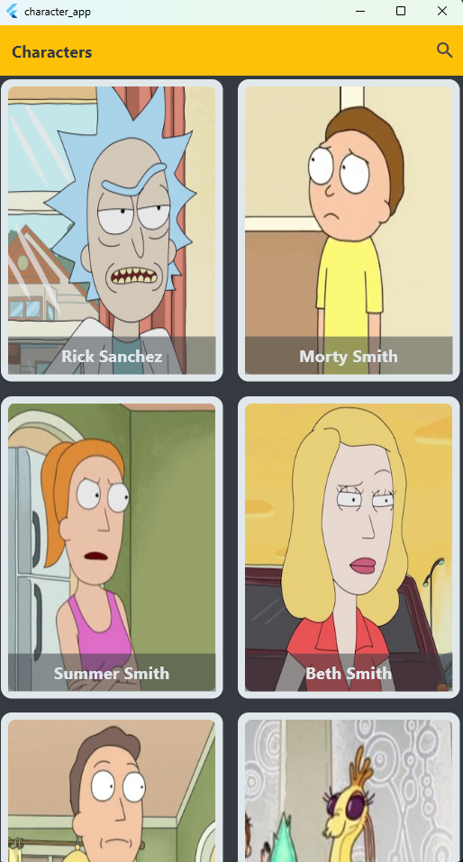
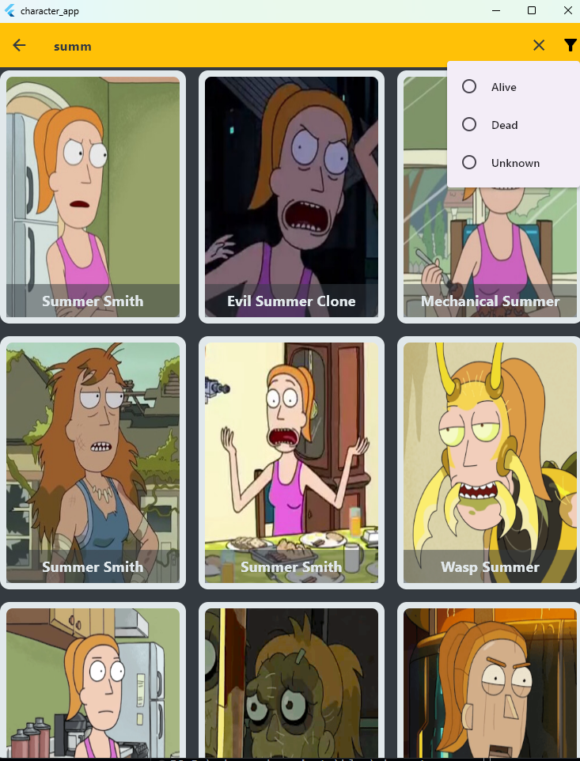

### **App: Character App**

Welcome to **Character App**! 🌀 This app is dedicated to displaying characters from the famous show "Rick and Morty." We are here to provide you with a fast and flexible user experience with many amazing features ✨.

---

## **🌈 Features 🌈**

### 1. **Responsive Design 📱💻**

We ensure that the app runs smoothly across all screen sizes. Whether you're using a small or large device, the design remains flexible and suitable for all devices. 📐

Responsive design means that the app automatically adjusts itself to fit the screen size of your device, making the app easy to use on both small phones and large tablets or laptops. This flexibility ensures that you can interact with the app easily without issues regarding appearance or usability.

  
  
  
  

### **2. Search with Filter 🔍**

With advanced search functionality and filters, you can easily find characters and narrow down the results based on your preferences. No more endless scrolling! 🔎

This feature allows you to search for characters by their names or other attributes such as species, status, or gender. Additionally, you can apply filters to refine the search results, ensuring that you only see characters that match your specific criteria. This improves the user experience, making it faster and more efficient to find the character you're looking for.

For example, if you're interested in characters from a particular species, you can filter the results accordingly. You can also use filters to search for characters based on their status (alive or dead) or gender. By using these filters, you eliminate the need to scroll through an endless list of characters, and you gain more control over your search process.

The **search with filter** functionality provides a smooth and intuitive way to quickly locate the characters you want to explore.

  
  
  

### 3. **Character Details 📜**

Tap on any character to view detailed information such as name, biography, and more, enhancing your user experience. 📖

This feature allows you to explore in-depth details about each character. It's not just about the name; you can dive into the character's background, history, and other details, making it a great way to learn more about each character.

  

---

### 4. **Shimmer Effect ✨**

We use the modern shimmer effect to display items while data is loading, providing a smooth experience as you navigate between screens. 🌟

When you open the app or navigate between pages, not all data may be loaded immediately. However, with the shimmer effect, a shimmering effect is shown on the items that are still loading, making the app look smoother and more dynamic.

---

### 5. **Pagination & Loading ⏳**

To ensure no delay in loading data, we load the data incrementally through pagination. You can easily browse through the list of characters! 🔄

This feature divides the data into smaller pages, which significantly reduces the load time. This way, you don't have to wait for all the data to load at once, and it can be loaded gradually as you scroll down.

---

### 6. **Issues to Fetch ⚠️**

If there's any issue fetching data, a clear notification will be displayed to help you quickly understand the problem. 🚨

Sometimes, fetching data may fail due to internet connectivity issues or server problems. In such cases, the app sends a notification that explains the reason, allowing the user to take appropriate action.

---

### 7. **Refresh Functionality 🔄**

If you want to update the data, you can use the refresh button to reload the content. 🔁

This feature allows you to refresh the data easily by tapping the refresh button. It's a quick way to get the latest data without having to restart the app.

---

### 8. **Start Fetching Data 🕒**

When starting the data fetching process, a custom image will appear to show the loading state. 🌀

When the app starts fetching data, a custom image appears indicating that the process is in progress. This helps keep the user informed and reduces the perception of delays.

---

## **🛠️ How to Use 🛠️**

### 1. **Installation:**

To install this project locally, follow these steps:

1. Download the project from [GitHub repository](https://github.com/MohammedAnwar2/character_app).
2. Run it using Flutter. 🚀

### 2. **Development:**

- Feel free to modify the design as you wish. 💡
- If you'd like to add more characters or details, you can modify the data in the UI. 🎨

---

## **🤝 Contribute to the Project 🤝**

If you would like to contribute to this project, feel free to open a pull request with your suggested changes. 👩‍💻👨‍💻

---

## **📬 Contact Us 📬**

If you have any questions or inquiries, or if you'd like to discuss improvements or suggestions for the project, you can reach us through the following channels:

- **Email**: moanbm123@gmail.com 📧
- **LinkedIn**: [@CharacterApp](https://www.linkedin.com/in/mohammad-anwar-50102725b/) 🐦
- **WhatsApp**: [Contact us on WhatsApp](https://wa.me/+917411440342) 📱

---

### **🌟 Thank you for visiting! 🌟**

We look forward to hearing your feedback and suggestions to improve your experience. 💬✨
